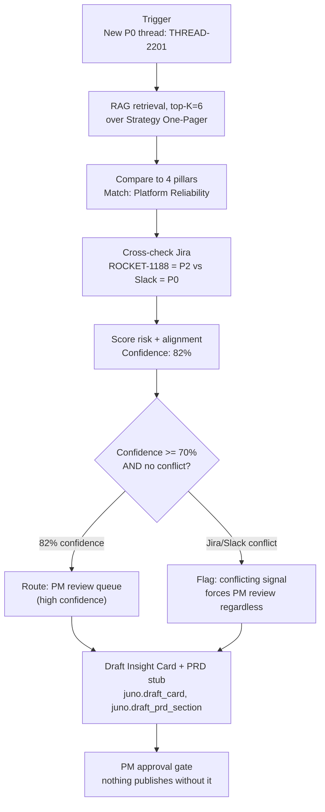

# Dry run diagram · THREAD-2201

Same shape as the Langflow graph in `Juno Agent.json`, annotated with what actually happened on this run rather than placeholder boxes.

**What this run actually exercised:** the AWSpec's Checkpoints rule says a conflicting signal forces PM review "regardless" of confidence. This is the first time that specific branch has been run against a real example, every prior document described it, none had shown a case where high confidence and a conflict happen on the same card. Here confidence was high (82%) and the conflict flag still won, PM review is required either way.
